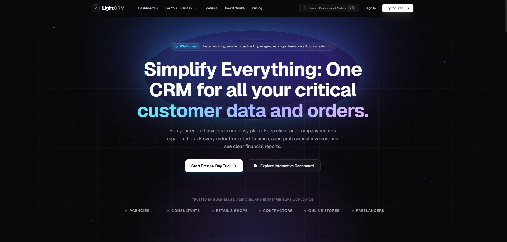

# LightCRM

An open-source, high-performance customer relationship management system engineered for modern businesses, agencies, and consultancies. Built with Next.js 16 (App Router), React 19, TypeScript, Tailwind CSS v4, and Supabase.

<p align="center">
  
</p>

<p align="center">
  <a href="https://nextjs.org/"></a>
  <a href="https://react.dev/"></a>
  <a href="https://www.typescriptlang.org/"></a>
  <a href="https://tailwindcss.com/"></a>
  <a href="https://supabase.com/"></a>
  <a href="#license"></a>
</p>

---

## Table of Contents

- [Overview](#overview)
- [Key Features](#key-features)
  - [Pipeline and Deal Flow Management](#pipeline-and-deal-flow-management)
  - [Lead Acquisition and Conversion Engine](#lead-acquisition-and-conversion-engine)
  - [Customer Directory and Account Intelligence](#customer-directory-and-account-intelligence)
  - [Task and Operational Agenda](#task-and-operational-agenda)
  - [Revenue Analytics and Funnel Intelligence](#revenue-analytics-and-funnel-intelligence)
  - [Real-Time Synchronization and Notifications](#real-time-synchronization-and-notifications)
  - [Global Command Palette (Cmd + K)](#global-command-palette-cmd--k)
  - [Responsive Mobile and Touch Experience](#responsive-mobile-and-touch-experience)
- [Architecture and Tech Stack](#architecture-and-tech-stack)
- [Project Structure](#project-structure)
- [Getting Started](#getting-started)
  - [Prerequisites](#prerequisites)
  - [Installation](#installation)
  - [Environment Configuration](#environment-configuration)
  - [Database Schema Setup](#database-schema-setup)
  - [Running Locally](#running-locally)
- [Available Scripts](#available-scripts)
- [Security and Authentication](#security-and-authentication)
- [Contributing](#contributing)
- [License](#license)

---

## Overview

LightCRM is a streamlined, full-stack CRM engineered to eliminate unnecessary administrative bloat while preserving deep analytical power. Designed for rapid operation and keyboard accessibility, LightCRM unifies sales pipelines, inbound lead tracking, client health monitoring, invoicing, and actionable agenda items within a cohesive, dark-themed interface.

The application features full real-time synchronization backed by Supabase PostgreSQL change subscriptions, optimistic client updates, server-side session authentication with middleware protection, and mobile responsive controls.

---

## Key Features

### Pipeline and Deal Flow Management
- **Interactive Drag-and-Drop Board**: Seamless visual progression of deals across five customizable stages: *New Inquiries*, *Qualified*, *Proposal / Demo*, *Negotiation*, and *Closed Won*.
- **Drag Ordering and State Persistence**: Deal ordering is maintained both optimistically in local browser cache and persisted directly to Supabase.
- **Deal Metadata and Priority Tiers**: Deals support monetary valuation, win probability percentages, customizable tag taxonomies, assignee allocation, days in stage, and urgency levels (*Urgent*, *High*, *Medium*, *Low*).
- **Slide-Over Deal Inspection Sheet**: Direct slide-out view allowing team members to update stages, review contact communications, log activity notes, and execute safe deletions without navigating away from the board.
- **Stage Filtering and Real-Time Search**: Instant filtering by priority status or company/contact search terms with zero input latency.

### Lead Acquisition and Conversion Engine
- **Comprehensive Lead Registry**: Centralized record keeping for inbound contacts including lead source tracking (*Website*, *LinkedIn*, *Referral*, *Outbound*, *Product Hunt*).
- **Lead Scoring System**: Built-in score quantification (0–100) and readiness tiers (*Hot*, *Warm*, *Qualified*, *Cold*).
- **One-Click Opportunity Conversion**: Transforms qualified leads directly into active pipeline deals while maintaining attribution history and purging stale lead records.
- **Batch Processing and Quick Filters**: Filter leads by acquisition channel or stage status, complete with bulk deletion and status management.

### Customer Directory and Account Intelligence
- **Account Health Monitoring**: Live tracking of account health indicators (*Excellent*, *Good*, *Needs Attention*, *At Risk*).
- **Customer Lifetime Value (LTV)**: Automated tracking of cumulative customer spend and active deal volume.
- **Account Tiers**: Categorization by tier (*Enterprise*, *Growth*, *Startup*) with renewal schedule tracking and last-contact timestamps.
- **Contextual Opportunity Creation**: Launch new deals pre-associated with existing customer profiles directly from the directory view.

### Task and Operational Agenda
- **Context-Aware Task Management**: Create, assign, and track action items tied directly to specific deals, leads, or customer profiles.
- **Multi-Type Classification**: Tasks categorized into *Call*, *Email*, *Meeting*, or *Document Review*.
- **Temporal Organization**: Automatic categorization across *Today*, *Upcoming*, and *Overdue* intervals.
- **Quick Status Toggle**: Optimistic task completion toggles backed by transactional database updates.

### Revenue Analytics and Funnel Intelligence
- **Monthly Revenue vs. Target Tracking**: Interactive dual-bar charts powered by Recharts illustrating actual closed revenue against quarterly quota targets.
- **Funnel Conversion Velocity**: Real-time step-by-step conversion analytics mapping drop-offs from initial inquiry to closed-won status with automated friction-point alerts.
- **High-Level Financial KPI Tiles**: Real-time calculation of Win Rate percentage, Average Deal Size, Average Sales Cycle Days, and Total Pipeline Valuation.

### Real-Time Synchronization and Notifications
- **Supabase Realtime PostgreSQL Listeners**: Live channel subscriptions across `deals`, `leads`, `customers`, `tasks`, and `notifications`. Changes made by team members reflect instantaneously without page refreshes.
- **Optimistic UI Updates with Deduplication**: Instant client-side responsiveness with duplicate-key prevention algorithms.
- **Event-Driven Notification Center**: In-app notifications for deal transitions, high-score lead registrations, and milestone achievements, accompanied by relative time ticker formatting (`date-fns`).

### Global Command Palette (Cmd + K)
- **Universal Keyboard Navigation**: Quick invocation via `Cmd + K` (macOS) or `Ctrl + K` (Windows/Linux).
- **Instant Search and Navigation**: Jump directly to pipeline boards, customer directories, analytics reports, or trigger entity creation modals using purely keyboard inputs.

### Responsive Mobile and Touch Experience
- **Full-Depth Mobile Glass Dock**: Bottom navigation dock with illuminated active states, haptic-friendly targets, and safe-area inset adaptation.
- **Mobile Stage Carousel**: Dedicated mobile stage tab selector for viewing pipeline columns without desktop drag-and-drop friction.
- **Adaptive Data Views**: Seamless transition from detailed data tables to responsive card layouts on small viewports.

---

## Architecture and Tech Stack

| Layer | Technology | Details |
| :--- | :--- | :--- |
| **Framework** | Next.js 16 (App Router) | React Server Components, Server Actions, Dynamic Routes |
| **UI Library** | React 19 | Hooks, Suspense, Concurrent Rendering |
| **Language** | TypeScript 5 | Strict type-safety across database models and UI props |
| **Styling** | Tailwind CSS v4 | Native PostCSS integration, dark palette, CSS variables |
| **Component Primitives** | Radix UI | Accessible dialogs, dropdowns, alert dialogs, sheets, tabs |
| **Motion & Animations** | Framer Motion | Smooth layout transitions, tab changes, and modal reveals |
| **Database & Auth** | Supabase | PostgreSQL, Row Level Security, Realtime Subscriptions, SSR Auth |
| **Charts & Metrics** | Recharts | Responsive SVG bar charts, custom tooltips, and funnel bars |
| **Drag and Drop** | @hello-pangea/dnd | Accessible, accessible-friendly Kanban card interaction |
| **Notifications & Toast** | Sonner | Stacked, non-intrusive action feedback toasts |
| **Date Processing** | date-fns | Robust relative timestamp formatting and ISO handling |

---

## Project Structure

```
LightCRM/
├── public/                     # Static assets, SVG emblems, and screenshot media
│   ├── screenshot.jpg          # Platform preview image
│   ├── lightcrm-logo.svg       # Brand logo
│   └── lightcrm-emblem.svg     # Brand emblem icon
├── src/
│   ├── app/                    # Next.js App Router root
│   │   ├── auth/callback/      # OAuth and email callback route handler
│   │   ├── dashboard/          # Authenticated CRM workspace and view router
│   │   ├── login/              # User authentication login view
│   │   ├── register/           # New account registration view
│   │   ├── layout.tsx          # Root layout and global theme provider
│   │   ├── page.tsx            # High-conversion marketing and landing page
│   │   └── globals.css         # Tailwind CSS v4 design tokens and utilities
│   ├── components/
│   │   ├── dashboard/          # Dashboard sub-views and operational modules
│   │   │   ├── analytics-view.tsx       # Revenue metrics and funnel charts
│   │   │   ├── confirm-delete-dialog.tsx# Reusable deletion safeguard modal
│   │   │   ├── create-record-dialog.tsx # Unified Deal/Lead/Customer creator
│   │   │   ├── customers-view.tsx       # Customer directory and LTV tracking
│   │   │   ├── dashboard-shell.tsx      # Sidebar, header, and mobile dock shell
│   │   │   ├── deal-card.tsx            # Draggable opportunity card component
│   │   │   ├── deal-detail-sheet.tsx    # Slide-over opportunity inspection drawer
│   │   │   ├── leads-view.tsx           # Lead intake and conversion directory
│   │   │   ├── pipeline-board.tsx       # Kanban drag-and-drop workspace
│   │   │   └── tasks-view.tsx           # Agenda, follow-up, and todo board
│   │   ├── ui/                 # Radix UI primitives and headless design elements
│   │   ├── command-menu.tsx    # Global Command Palette (Cmd + K)
│   │   ├── hero.tsx            # Marketing hero showcase
│   │   ├── hero-mockup.tsx     # Interactive preview on landing page
│   │   ├── persona-tabs.tsx    # Multi-persona capability tabs
│   │   └── bento-grid.tsx      # Interactive feature simulators
│   ├── data/
│   │   ├── dashboard-mock-data.ts # Seed schemas, types, and fallback data
│   │   └── mock-data.ts        # Landing page mock data structures
│   └── lib/
│       ├── supabase/           # Client, Server, and Middleware Supabase handlers
│       │   ├── client.ts       # Browser-side Supabase client
│       │   ├── server.ts       # Server-side Supabase client
│       │   ├── middleware.ts   # Session verification and protected route redirection
│       │   └── crm-service.ts  # Database abstraction layer and queries
│       ├── date-utils.ts       # Relative date formatting utilities
│       └── utils.ts            # Class name merging helper (clsx, twMerge)
├── next.config.ts              # Next.js configuration
├── package.json                # Project dependencies and operational scripts
├── tsconfig.json               # TypeScript configuration
└── AGENTS.md                   # Agent and development rules
```

---

## Getting Started

### Prerequisites

Ensure the following tools are installed on your machine:
- **Node.js**: Version 18.18 or higher (Node 20+ recommended)
- **Package Manager**: `npm`, `pnpm`, or `yarn`
- **Supabase Account**: A Supabase project for PostgreSQL and Authentication

### Installation

1. Clone the repository to your local environment:
   ```bash
   git clone https://github.com/Sina-Majd/LightCRM.git
   cd LightCRM
   ```

2. Install project dependencies:
   ```bash
   npm install
   ```

### Environment Configuration

Create an `.env.local` file in the project root directory:

```env
# Supabase Configuration
NEXT_PUBLIC_SUPABASE_URL=https://your-project-id.supabase.co
NEXT_PUBLIC_SUPABASE_ANON_KEY=your-supabase-anon-key
NEXT_PUBLIC_SUPABASE_PUBLISHABLE_KEY=your-supabase-publishable-key
```

### Database Schema Setup

Execute the following SQL script inside your Supabase project's SQL Editor to bootstrap the database tables and foreign key relationships:

```sql
-- Profiles table linked to Supabase Auth
create table if not exists public.profiles (
  id uuid references auth.users on delete cascade primary key,
  full_name text default 'Sales Executive',
  company_name text default 'Organization',
  email text,
  role text default 'Account Executive',
  status text default 'Available' check (status in ('Available', 'Away', 'Do Not Disturb')),
  plan text default 'business',
  updated_at timestamp with time zone default timezone('utc'::text, now())
);

-- Pipeline Stages table
create table if not exists public.pipeline_stages (
  id uuid default gen_random_uuid() primary key,
  user_id uuid references auth.users on delete cascade not null,
  stage_key text not null,
  title text not null,
  position integer not null default 0,
  created_at timestamp with time zone default timezone('utc'::text, now())
);

-- Deals / Opportunities table
create table if not exists public.deals (
  id uuid default gen_random_uuid() primary key,
  user_id uuid references auth.users on delete cascade not null,
  title text not null,
  company text not null,
  contact text not null,
  email text default '',
  phone text default '',
  value numeric default 0,
  stage_id text not null default 'stage-new',
  priority text default 'medium' check (priority in ('urgent', 'high', 'medium', 'low')),
  probability integer default 50,
  tags text[] default array[]::text[],
  notes text default '',
  days_in_stage integer default 0,
  last_activity text default 'Just now',
  assignee_name text default 'You',
  assignee_avatar text default '',
  created_at timestamp with time zone default timezone('utc'::text, now()),
  updated_at timestamp with time zone default timezone('utc'::text, now())
);

-- Inbound Leads table
create table if not exists public.leads (
  id uuid default gen_random_uuid() primary key,
  user_id uuid references auth.users on delete cascade not null,
  name text not null,
  company text not null,
  email text not null,
  phone text default '',
  title text default '',
  score integer default 50,
  status text default 'warm' check (status in ('hot', 'warm', 'qualified', 'cold')),
  source text default 'Website',
  estimated_value numeric default 0,
  notes text default '',
  assigned_to text default 'You',
  created_at timestamp with time zone default timezone('utc'::text, now()),
  updated_at timestamp with time zone default timezone('utc'::text, now())
);

-- Customers table
create table if not exists public.customers (
  id uuid default gen_random_uuid() primary key,
  user_id uuid references auth.users on delete cascade not null,
  name text not null,
  company text not null,
  email text not null,
  phone text default '',
  ltv numeric default 0,
  active_deals_count integer default 1,
  health_score integer default 90,
  health_status text default 'good' check (health_status in ('excellent', 'good', 'warning', 'critical')),
  tier text default 'Growth' check (tier in ('Enterprise', 'Growth', 'Startup')),
  renewal_date text default 'In 12 Months',
  last_touch text default 'Just now',
  location text default 'Global',
  industry text default 'Technology',
  created_at timestamp with time zone default timezone('utc'::text, now())
);

-- Tasks / Agenda table
create table if not exists public.tasks (
  id uuid default gen_random_uuid() primary key,
  user_id uuid references auth.users on delete cascade not null,
  title text not null,
  type text default 'email' check (type in ('call', 'email', 'meeting', 'review')),
  due_date text not null,
  due_category text default 'today' check (due_category in ('today', 'upcoming', 'overdue')),
  priority text default 'medium' check (priority in ('urgent', 'high', 'medium', 'low')),
  completed boolean default false,
  related_to text default '',
  related_type text default 'deal' check (related_type in ('deal', 'lead', 'customer')),
  created_at timestamp with time zone default timezone('utc'::text, now()),
  updated_at timestamp with time zone default timezone('utc'::text, now())
);

-- Notifications table
create table if not exists public.notifications (
  id uuid default gen_random_uuid() primary key,
  user_id uuid references auth.users on delete cascade not null,
  title text not null,
  description text not null,
  time text,
  read boolean default false,
  type text default 'system' check (type in ('deal', 'lead', 'payment', 'customer', 'system')),
  created_at timestamp with time zone default timezone('utc'::text, now())
);

-- Enable Row Level Security (RLS) on all tables
alter table public.profiles enable row level security;
alter table public.pipeline_stages enable row level security;
alter table public.deals enable row level security;
alter table public.leads enable row level security;
alter table public.customers enable row level security;
alter table public.tasks enable row level security;
alter table public.notifications enable row level security;

-- Establish basic RLS Policies for authenticated users
create policy "Users can access own profile" on public.profiles for all using (auth.uid() = id);
create policy "Users can access own stages" on public.pipeline_stages for all using (auth.uid() = user_id);
create policy "Users can access own deals" on public.deals for all using (auth.uid() = user_id);
create policy "Users can access own leads" on public.leads for all using (auth.uid() = user_id);
create policy "Users can access own customers" on public.customers for all using (auth.uid() = user_id);
create policy "Users can access own tasks" on public.tasks for all using (auth.uid() = user_id);
create policy "Users can access own notifications" on public.notifications for all using (auth.uid() = user_id);

-- Enable Supabase Realtime Replication for tables
alter publication supabase_realtime add table public.deals;
alter publication supabase_realtime add table public.leads;
alter publication supabase_realtime add table public.customers;
alter publication supabase_realtime add table public.tasks;
alter publication supabase_realtime add table public.notifications;
```

### Running Locally

Start the development server:

```bash
npm run dev
```

Open [http://localhost:3000](http://localhost:3000) in your web browser.

---

## Available Scripts

The following npm commands are available in the project:

| Script | Command | Description |
| :--- | :--- | :--- |
| `npm run dev` | `next dev` | Starts the local development server with Turbopack |
| `npm run build` | `next build` | Compiles the production build |
| `npm run start` | `next start` | Runs the compiled production application |
| `npm run lint` | `eslint` | Executes ESLint analysis to verify code standards |

---

## Security and Authentication

- **Middleware Route Protection**: Configured via `src/proxy.ts` and `src/lib/supabase/middleware.ts`, preventing unauthenticated access to `/dashboard/*` while directing logged-in users away from auth endpoints (`/login`, `/register`).
- **Row Level Security (RLS)**: Enforced directly at the PostgreSQL layer, isolating all records strictly to the authenticating user (`auth.uid() = user_id`).
- **Input Sanitization & Type Safety**: Client inputs are constrained via strongly typed schemas and sanitized dialog inputs.

---

## Contributing

Contributions are welcome and appreciated. To contribute:

1. Fork the repository.
2. Create your feature branch (`git checkout -b feature/enhanced-reporting`).
3. Commit your changes with conventional commit messages (`git commit -m 'feat: add export to CSV in deals view'`).
4. Push to your branch (`git push origin feature/enhanced-reporting`).
5. Open a Pull Request detailing your changes and test coverage.

Please ensure your code passes linting (`npm run lint`) and builds cleanly before submitting PRs.

---

## License

This project is licensed under the MIT License. See the [LICENSE](LICENSE) file for complete details.
